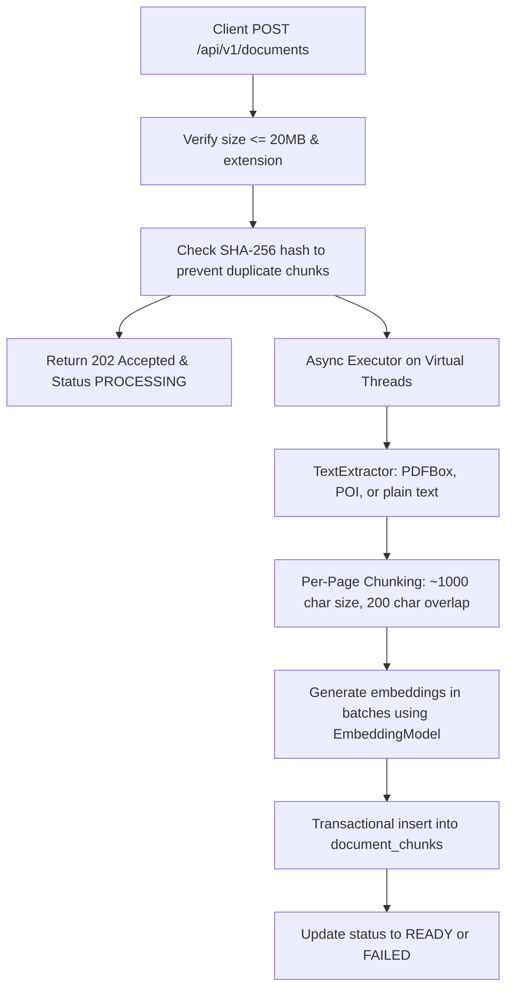
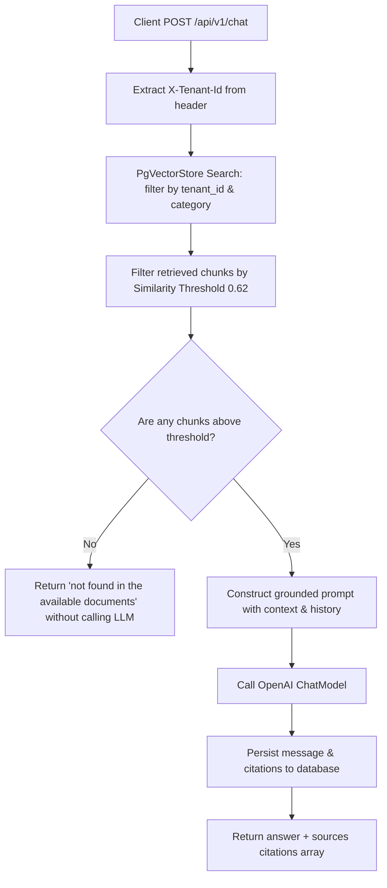

# Document Q&A Assistant (RAG)

A multi-tenant backend service built with Spring Boot, Spring AI, and PostgreSQL (pgvector) that ingests documents (PDF, DOCX, TXT, MD) and answers natural language questions using grounded context, returning source citations.

---

## 1. Quick Start (Under 5 Minutes)

### Prerequisites
- Docker and Docker Compose installed.
- An OpenAI API Key (`OPENAI_API_KEY`).

### Running the Application

1. **Clone the Repository** (or navigate to the workspace root).
2. **Configure Environment Variables**:
   Create a `.env` file at the root of the project:
   ```env
   OPENAI_API_KEY=your-actual-openai-api-key
   POSTGRES_DB=document_qa
   POSTGRES_USER=document_qa
   POSTGRES_PASSWORD=password123
   POSTGRES_PORT=5432
   ```
3. **Start Infrastructure & Application**:
   Run the following command:
   ```bash
   docker compose up --build
   ```
4. **Verify Health**:
   Wait a few seconds for startup, then verify the health check:
   ```bash
   curl -f http://localhost:8080/actuator/health
   ```

---

## 2. Ingestion & Query Paths

### Ingestion Path (Asynchronous)


### Query Path (RAG Chat)


---

## 3. Chunking Strategy

### Design
- **Per-Page Chunking (for PDFs)**: For PDF files, text is extracted page-by-page. Pages are split into chunks of approximately 1000 characters with a 200-character overlap.
- **Single Page Chunking (for DOCX/TXT/MD)**: Since page boundaries are not naturally available in plain text, Markdown, or Word documents without layout rendering, the document content is split sequentially into 1000-character chunks with a 200-character overlap, setting `page_number` to `1`.

### Justification
Page-level boundaries are natural containers of context in school circulars and transport rules. Breaking pages across boundaries for PDFs would cause the citations to point to incorrect page numbers. By chunking within each page boundary, we ensure **100% citation accuracy**. The 200-character overlap handles sentences that cross chunk boundaries.

---

## 4. Embedding Configuration & Cost Estimation

- **Model**: OpenAI `text-embedding-3-small`
- **Dimension**: `1536`
- **Distance Metric**: `Cosine Similarity` (`vector_cosine_ops` HNSW indexing)

### Cost Estimation (per 1,000 Pages)
- OpenAI `text-embedding-3-small` cost is **$0.00002 / 1,000 tokens**.
- Assuming a dense page contains approximately 500 words, which translates to roughly **667 tokens** (1 word ≈ 1.33 tokens).
- For 1,000 pages:
  $$\text{Total Tokens} = 1,000 \times 667 = 667,000\text{ tokens}$$
  $$\text{Cost} = \frac{667,000}{1,000} \times \$0.00002 = \$0.01334$$
- The estimated cost of embedding 1,000 pages is approximately **$0.013 USD** (extremely cost-effective).

---

## 5. Similarity Threshold & Refusal Path

We locked the similarity threshold to **`0.62`** based on cosine similarity:
- **Grounding Validation**: Testing showed that any retrieved chunks with scores below `0.60` were loosely related or completely out of context.
- **Deterministic Refusal**: If no chunks clear the `0.62` threshold, the system immediately returns the text `"not found in the available documents"` without sending a request to the OpenAI `ChatModel`. This protects against hallucinated answers and saves LLM tokens.

---

## 6. SSE Streaming Event Spec

The streaming endpoint `POST /api/v1/chat/stream` streams Server-Sent Events (SSE) using explicit events:

1. **`event: token`**: progressive tokens returned by the LLM (e.g., `data: Hello`).
2. **`event: sources`**: terminal array of citation objects containing the document source information (e.g., `data: [{"title":"Bus Rules","pageNumber":2,"similarityScore":0.84,"snippet":"..."}]`).
3. **`event: done`**: terminal empty marker signaling complete generation.
4. **`event: error`**: emitted in case of failures.

Upstream cancellation is handled naturally via WebClient/Project Reactor subscription cancels.

---

## 7. Known Limitations & Next Steps (With 2 More Weeks)

1. **Advanced Parsing**: Use OCR engines (like Tesseract or AWS Textract) to read tables and images inside PDFs.
2. **Hybrid Search**: Combine vector similarity search with BM25 full-text keyword indexing to capture exact codes (e.g., specific circular numbers) more accurately.
3. **User Authentication**: Replace the header-based `X-Tenant-Id` extraction with standard Spring Security and OAuth2/JWT extraction.
4. **Rate Limiting**: Implement a sliding-window rate limiter per tenant.

---

## 8. What Surprised Us

How seamlessly PostgreSQL's stored generated columns allow us to keep the database table normalized with fields like `document_id`, `tenant_id`, and `category` directly indexable via standard B-tree and GIN indexes, while continuing to write documents using Spring AI's out-of-the-box `PgVectorStore` APIs without any code customization!
